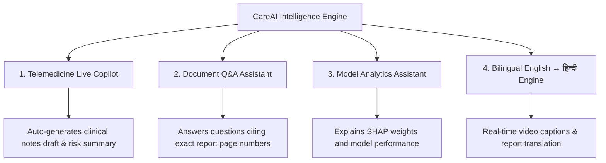

# CareAI Intelligence & Conversational Copilot

**CareAI** is the platform's multi-modal clinical assistant that operates during telemedicine consultations, document reviews, and population health analytics.

---

## 1. Core Functions

---

## 2. Telemedicine Live Copilot

During video consultations (`/consultation/careai`), CareAI:
- Displays Eleanor Vance's **68% High Risk Assessment** and key elevated biomarkers (Creatinine $1.60\text{ mg/dL}$, Hemoglobin $11.2\text{ g/dL}$).
- Recommends the **PPO Optimal Care Pathway**: *Early PCP Follow-up within 72h + Pharmacy Medication Reconciliation*.
- Generates editable clinical progress note drafts for attending physician Dr. J. Aris.

---

## 3. "Ask About This Report" Q&A

Implemented in `ml/doc_engine.py`:
- Ingests structured OCR text from lab panels and discharge summaries.
- Answers patient and doctor inquiries with exact page citations:
  - *User*: "What is my creatinine and is it normal?"
  - *CareAI*: "Your Serum Creatinine is **1.60 mg/dL**, which is elevated above the standard reference range ($0.50 - 1.10\text{ mg/dL}$). This indicates mild renal filtration stress. (Cited: Page 1, Metabolic Panel)."
- Supports voice input transcription simulation in English and Hindi.

---

## 4. "Ask the Model" Analytics Assistant

Implemented in `ml/mlops_manager.py`:
- Provides conversational access to ML metrics, feature importance rankings, and data drift statuses for clinical data scientists and administrators (`/ml/chat`).
