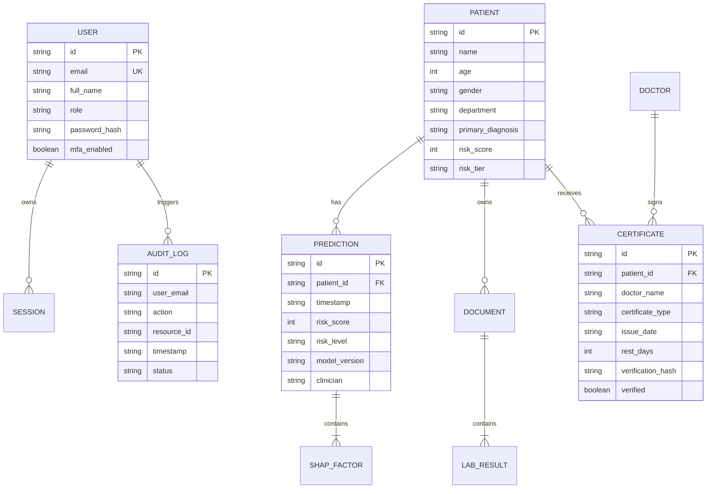

# Database Schema

The database model manages patients, historical predictions, medical documents, certificates, user identities, and security audit trails.

---

## 1. Entity-Relationship Diagram (ERD)

