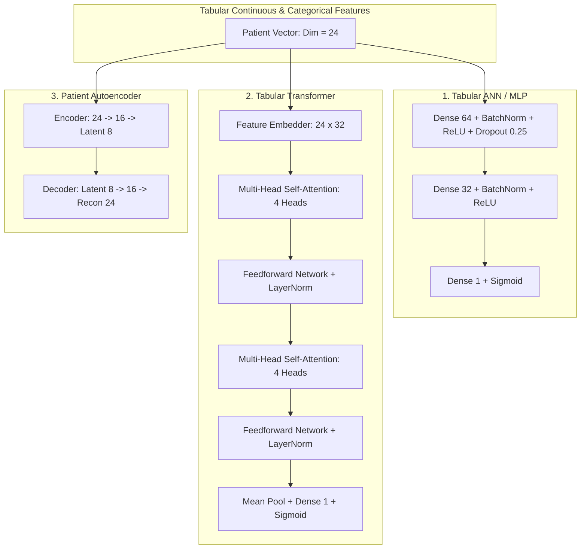

# Deep Learning Documentation

This section provides technical details for the PyTorch Deep Learning laboratory implemented in `ml/deep_models.py`, covering neural architectures, attention mechanisms, latent autoencoders, and temporal sequence modeling.

---

## 1. Deep Learning Architectures

---

## 2. Model 1: Tabular ANN / MLP (`TabularANN`)

Designed for robust non-linear tabular feature interaction:
- **Input Dimension**: 24 normalized patient features
- **Hidden Layers**: Dense(64) $\to$ BatchNorm1d $\to$ ReLU $\to$ Dropout(0.25) $\to$ Dense(32) $\to$ BatchNorm1d $\to$ ReLU $\to$ Dense(1) $\to$ Sigmoid
- **Loss Function**: Binary Cross Entropy with Logits / BCE Loss
- **Optimizer**: AdamW ($\text{lr}=1\times 10^{-3}$, weight decay $=1\times 10^{-4}$)

---

## 3. Model 2: Tabular Transformer (`TabularTransformer`)

Leverages multi-head self-attention to capture pairwise relationships between clinical biomarkers (e.g., interaction between Serum Creatinine and Blood Urea Nitrogen):
- **Feature Tokenizer**: Projects each continuous scalar into a $d_{\text{model}}=32$ dimensional token.
- **Attention Blocks**: 2 Transformer Encoder layers with $n_{\text{heads}}=4$, $d_{\text{ff}}=128$, and Layer Normalization.
- **Classification Head**: Aggregates sequence tokens via mean pooling followed by a linear projection layer.

---

## 4. Model 3: Patient Autoencoder (`PatientAutoencoder`)

Used for clinical representation learning, anomaly detection, and patient similarity matching:
- **Encoder**: Compresses 24-dimensional feature vector $\to 16 \to 8$ latent dimensions.
- **Bottleneck ($z \in \mathbb{R}^8$)**: Dense continuous patient embedding used for 2D PCA/t-SNE visualization and patient similarity queries.
- **Decoder**: Reconstructs 24 input features ($\text{MSE Loss}$). High reconstruction error flags novel clinical presentation or data anomalies.

---

## 5. Model 4: Sequence LSTM (`SequenceLSTM`)

Models temporal inpatient encounters and longitudinal laboratory shifts:
- **Input**: 3D Tensor $(\text{Batch}, \text{Timesteps}=4, \text{Features}=8)$ representing sequential visits.
- **Hidden Layers**: 2-layer LSTM with hidden dimension 32 and bidirectional hidden state concatenation.
- **Output**: Binary classification head estimating 30-day readmission risk after the most recent encounter.
