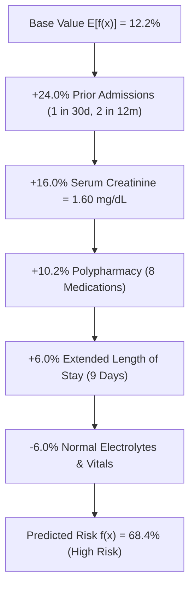

# Explainable AI (XAI) Documentation

Explainability is essential for clinical decision-support systems. HRP Clinical integrates **TreeSHAP (SHapley Additive exPlanations)**, global feature gain rankings, and 2D patient embeddings.

---

## 1. Local SHAP Waterfall Decomposition

For each patient assessment, the system decomposes the model's predicted probability $f(x)$ relative to the expected base rate $E[f(x)] = 12.2\%$:

$$f(x) = E[f(x)] + \sum_{j=1}^{M} \phi_j(x)$$

Where $\phi_j(x)$ represents the exact contribution of feature $j$.

---

## 2. Terminology: Model-Associated Factors

> 📌 **Clinical Clarification**:
> SHAP feature attributions are documented as **model-associated factors** rather than direct biological causes. A positive SHAP attribution indicates statistical correlation with readmission risk in the historical training cohort.

---

## 3. Global Feature Importance (Gain Weight Attribution)

1. **`prior_admissions_30d`** (28.4%): Acute prior utilization is the strongest statistical predictor of repeat hospitalization.
2. **`creatinine_level`** (18.2%): Marker of renal dysfunction and impaired medication clearance.
3. **`medication_count`** (14.6%): Polypharmacy indicator associated with adverse drug events.
4. **`length_of_stay`** (11.8%): Proxy for initial admission severity.
5. **`haemoglobin_level`** (9.5%): Low hemoglobin correlates with fatigue and cardiovascular stress.
6. **`age_years`** (7.1%): Chronological age and associated frailty.
7. **`primary_diagnosis_chf`** (5.8%): Congestive Heart Failure comorbidity.
8. **`blood_urea_nitrogen`** (4.6%): Renal filtration biomarker.

---

## 4. 2D Patient Risk Embeddings (PCA / Autoencoder)

Located at `/ml/embeddings`:
- Reduces 24-dimensional patient profiles into 2 principal components ($PC_1, PC_2$).
- Highlights clustering: High-Risk cardiac/renal cohorts cluster distinctly from Low-Risk acute recovery patients.
- Clinicians can click individual points to inspect nearest historical patient profiles.
