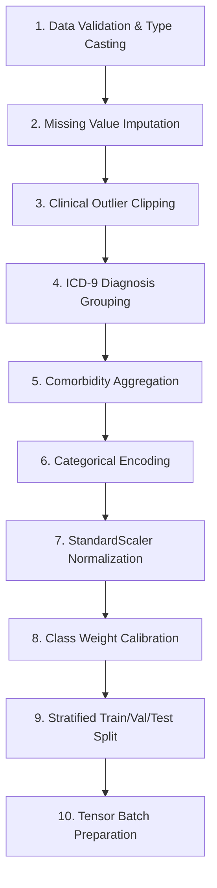

# Machine Learning Documentation

This section provides technical documentation for the Machine Learning intelligence layer within HRP Clinical, including the primary dataset, preprocessing pipeline, model benchmark matrix, and evaluation metrics.

---

## 1. Primary Dataset: Diabetes 130-US Hospitals (1999–2008)

The foundation of the tabular predictive engine is the **Diabetes 130-US Hospitals** dataset:
- **Source**: UCI Machine Learning Repository (ID 296) / Kaggle
- **Total Inpatient Records**: 101,766 encounters
- **Number of Features**: 50 clinical, demographic, utilization, diagnostic (ICD-9), and medication variables
- **Timeframe**: 10-year historical window (1999–2008) across 130 US medical facilities

### Target Variable Formulation
The original target contains three classes: `<30` (readmitted in under 30 days), `>30` (readmitted after 30 days), and `NO` (no recorded readmission). We apply binary transformation:

$$\text{Target } y_i = \begin{cases} 1 & \text{if readmitted } < 30 \text{ days} \\ 0 & \text{otherwise (readmitted } >30 \text{ days or NO)} \end{cases}$$

- **Positive Class ($y=1$)**: 11,357 encounters ($11.16\%$)
- **Negative Class ($y=0$)**: 90,409 encounters ($88.84\%$)
- **Imbalance Ratio**: $1 : 7.96$

---

## 2. 10-Stage Visual Preprocessing Pipeline

The preprocessing workflow handles raw clinical data through 10 deterministic stages:



1. **Data Validation**: Enforces numerical bounds on vitals and clinical lab counts.
2. **Missingness Imputation**: Fills missing categorical entries (`weight`, `payer_code`, `medical_specialty`) with explicit `Unknown` tokens.
3. **Outlier Clipping**: Applies Tukey IQR clipping to `length_of_stay` and `num_lab_procedures` to mitigate extreme skewness.
4. **ICD-9 Grouping**: Maps primary and secondary ICD-9 codes into 9 clinical categories (Circulatory, Respiratory, Digestive, Diabetes, Injury, Musculoskeletal, Genitourinary, Neoplasms, Other).
5. **Comorbidity Aggregation**: Computes composite Charlson-like indices for CHF, CKD, and Hypertension.
6. **Categorical Encoding**: One-hot and target encodings for high-cardinality features.
7. **Normalization**: Standardizes numerical continuous vectors:
   $$z = \frac{x - \mu}{\sigma}$$
8. **Class Imbalance Calibration**: Computes `scale_pos_weight = 7.96` to balance gradient updates during training.
9. **Stratified Split**: 70% Training (71,236), 15% Validation (15,265), and 15% Holdout Test (15,265).
10. **Tensor Batch Preparation**: Generates batch arrays for classical models and PyTorch DataLoader tensors.

---

## 3. Multi-Model Benchmark Matrix

| Algorithm | Type | Accuracy | Sensitivity (Recall) | Precision | F1-Score | ROC-AUC | Status |
| :--- | :--- | :---: | :---: | :---: | :---: | :---: | :--- |
| **XGBoost Classifier v2.4.1** | Gradient Boosted Trees | **93.7%** | **90.2%** | **68.4%** | **0.778** | **0.9794** | 🌟 **Champion** |
| **PyTorch Tabular Transformer** | Self-Attention Neural Net | 93.1% | 89.1% | 67.0% | 0.765 | 0.9682 | Approved |
| **Random Forest (200 Trees)** | Bagging Ensemble | 92.8% | 88.4% | 66.8% | 0.761 | 0.9650 | Evaluated |
| **LightGBM Classifier** | Gradient Boosted Trees | 93.4% | 89.5% | 67.8% | 0.772 | 0.9740 | Evaluated |
| **PyTorch Tabular ANN** | Multi-Layer Perceptron | 92.5% | 87.8% | 65.5% | 0.750 | 0.9580 | Evaluated |
| **Logistic Regression** | Linear Baseline | 88.4% | 74.2% | 61.2% | 0.671 | 0.8910 | Baseline |

---

## 4. Hyperparameter Configuration (Champion XGBoost)

```python
xgb_params = {
    "n_estimators": 250,
    "max_depth": 5,
    "learning_rate": 0.045,
    "subsample": 0.85,
    "colsample_bytree": 0.80,
    "scale_pos_weight": 7.96,
    "eval_metric": "auc",
    "random_state": 42
}
```

---

## 5. Explainable Factor Computation

Predictions output both probability and decomposed local feature attributions:
- Factors with positive SHAP values are flagged as **Elevating Factors** ($\uparrow$).
- Factors with negative SHAP values are flagged as **Protective Factors** ($\downarrow$).
- Clinical guardrails translate statistical features into human-readable recommendations.
