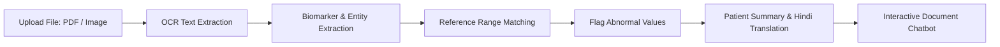

# Medical Document Intelligence

The Medical Document Intelligence system parses unformatted medical files (PDF, JPG, PNG, DOCX) into structured clinical data, extracts biomarkers, and provides patient-friendly explanations.

---

## 1. Document Extraction Pipeline

---

## 2. Laboratory Panel Extraction

Implemented in `ml/doc_engine.py`:
- **Document Example**: `DOC-84729-LAB` (*Comprehensive Metabolic Panel & CBC — Eleanor Vance*).
- **OCR Confidence**: $98.4\%$ confidence score.

### Extracted Biomarkers:
| Biomarker | Reported Value | Standard Range | Status | Clinical Significance |
| :--- | :---: | :---: | :---: | :--- |
| **Serum Creatinine** | **1.60 mg/dL** | 0.50 – 1.10 | 🔴 High | Elevated renal filtration stress |
| **Hemoglobin** | **11.2 g/dL** | 12.0 – 16.0 | 🟡 Low | Mild normocytic anemia |
| **Blood Urea Nitrogen**| **28.0 mg/dL** | 7.0 – 20.0 | 🔴 High | Prerenal azotemia / dehydration |
| **HbA1c** | **7.4 %** | 4.0 – 5.6 | 🔴 High | Suboptimal glycemic control |
| **Serum Sodium** | 138 mEq/L | 135 – 145 | 🟢 Normal | Electrolyte balance maintained |
| **Serum Potassium** | 4.2 mEq/L | 3.5 – 5.0 | 🟢 Normal | Normokalemic stability |
| **White Blood Cells** | 8.4 k/uL | 4.5 – 11.0 | 🟢 Normal | No active acute leukocytosis |

---

## 3. Patient-Friendly AI Explanations

Translates complex laboratory terminology into clear, accessible language with one-click **हिन्दी अनुवाद**:
- *English*: "Your kidney function test (Creatinine) is slightly higher than usual at 1.60 mg/dL. Your doctor will discuss hydration and medication adjustments."
- *हिन्दी*: "आपकी किडनी फंक्शन रिपोर्ट (क्रिएटिनिन) 1.60 mg/dL पर सामान्य से थोड़ी अधिक है। डॉक्टर जलयोजन और दवाओं की समीक्षा करेंगे।"
