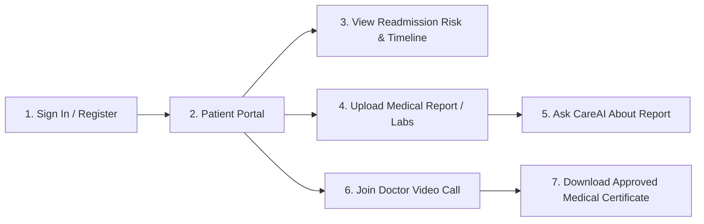
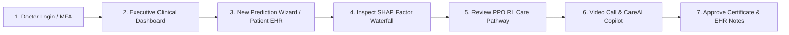
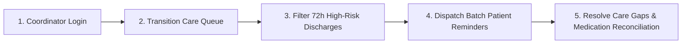
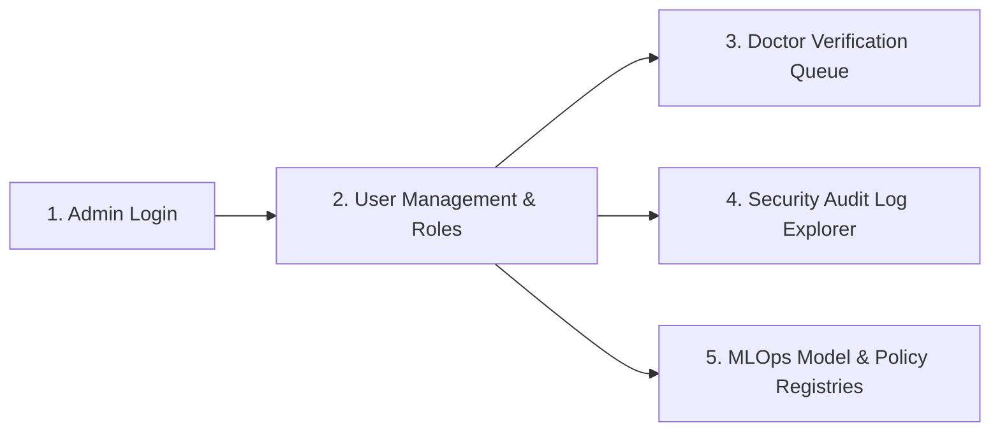

# Product Workflows

This document outlines the end-to-end user journeys for the 4 core roles supported by HRP Clinical: **Patient**, **Doctor / Clinician**, **Care Coordinator**, and **Hospital Administrator**.

---

## 1. Patient Journey

### Steps:
1. **Authentication**: Patient logs in via email/password or OTP and lands in the dedicated **Patient Portal** (`/portal/patient`).
2. **Personal Risk & Timeline Review**: Inspects personal 30-day readmission risk estimate ($68\%$), recent medication changes, and upcoming clinical follow-ups.
3. **Medical Report Upload & Q&A**: Uploads laboratory panels (PDF/Images) and uses "Ask About This Report" with bilingual translation (English $\leftrightarrow$ हिन्दी) to understand kidney biomarkers (Creatinine) and anemia status (Hemoglobin).
4. **Telemedicine Consultation**: Joins encrypted video call with attending physician and receives dual real-time subtitles.
5. **Certificates & Records**: Accesses doctor-approved medical certificates with verification QR codes for workplace leave.

---

## 2. Doctor / Clinician Journey

### Steps:
1. **Authentication**: Clinician logs in with institutional credentials and completes 6-digit MFA verification.
2. **Clinical Dashboard & Directory**: Reviews high-risk patient alerts across the ward (`/dashboard`, `/patients`).
3. **Risk Evaluation & TreeSHAP**: Inputs clinical variables into the 4-step wizard (`/prediction/new`) or opens an existing assessment (`/prediction/PT-84729`) to inspect SHAP waterfall feature attributions.
4. **RL Decision Support**: Reviews the PPO care pathway recommendation (e.g., *72h PCP Follow-up + Pharmacist Medication Reconciliation*) and decides to `Approve`, `Modify`, or `Reject`.
5. **Telemedicine Video Call**: Conducts video consultation with CareAI live summaries and dual subtitles (`/consultation/careai`).
6. **Certificate Issuance**: Reviews and digitally signs official medical certificates (`/certificates/new`).

---

## 3. Care Coordinator Journey

### Steps:
1. **Queue Inspection**: Opens Care Coordinator Queue (`/portal/coordinator`).
2. **Prioritization**: Identifies high-risk patients within the acute 72-hour discharge window.
3. **Engagement**: Dispatches automated appointment reminders and schedules tele-health check-ins.
4. **Reconciliation**: Confirms medication fill status and closes care gaps before readmission occurs.

---

## 4. Hospital Administrator Journey

### Steps:
1. **User Governance**: Manages accounts, role assignments, and MFA resets (`/admin/users`).
2. **Credential Verification**: Verifies medical board license numbers and approves pending doctor accounts (`/admin/doctor-verification`).
3. **Audit Inspection**: Analyzes tamper-evident security audit logs tracking logins, EHR views, and break-glass events (`/admin/audit-logs`).
4. **MLOps Governance**: Inspects data drift (KS-test / PSI), promotes models, and audits RL policies (`/ml/registry`, `/ml/monitoring`).
