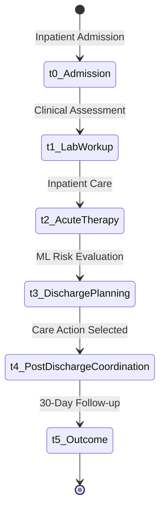

# Reinforcement Learning Documentation

This section details the Reinforcement Learning (RL) research and clinical decision-support module implemented in `ml/rl_engine.py`. 

> ⚠️ **Clinical Safety Constraint**: The RL module is designed exclusively as a **simulation and decision-support research tool**, not an autonomous medical decision-maker. It does not prescribe medications or perform diagnostic interventions.

---

## 1. The 6-Stage Care Journey MDP

The patient trajectory is modeled as a discrete-event Markov Decision Process (MDP):

$$\mathcal{M} = \langle \mathcal{S}, \mathcal{A}, \mathcal{P}, \mathcal{R}, \gamma \rangle$$

- **$t_0$ Inpatient Admission & Triage**: Patient history and acute symptoms recorded.
- **$t_1$ Laboratory & Diagnostic Workup**: Baseline metabolic panels, CBC, and vital signs collected.
- **$t_2$ Inpatient Acute Therapy**: Stabilization and medication titrations performed.
- **$t_3$ Discharge Planning & Risk Scoring**: Predictive ML models estimate 30-day readmission risk ($68\%$).
- **$t_4$ Post-Discharge Care Action**: RL agent suggests structured follow-up interventions.
- **$t_5$ 30-Day Terminal Health Outcome**: Terminal reward evaluated based on readmission occurrence.

---

## 2. Action Space ($\mathcal{A}$)

The environment supports an 8-action discrete library focused strictly on care coordination:

| Action ID | Action Name | Category | Description |
| :---: | :--- | :--- | :--- |
| `0` | `STANDARD_DISCHARGE` | Routine Care | Standard discharge summary and routine primary care follow-up. |
| `1` | `EARLY_PCP_FOLLOWUP_72H` | Care Transition | Priority primary care physician consultation within 72 hours. |
| `2` | `CARE_COORDINATOR_DISPATCH` | Outpatient Support | Dedicated care coordinator assigned for 14-day transition monitoring. |
| `3` | `PHARMACY_MED_RECONCILIATION` | Medication Safety | Comprehensive pharmacist reconciliation and adherence consultation. |
| `4` | `TELEHEALTH_CHECKIN_7D` | Virtual Care | Scheduled video/tele-health check-in on post-discharge day 7. |
| `5` | `HOME_HEALTH_EVALUATION` | Skilled Care | In-home nursing evaluation and vital sign assessment. |
| `6` | `DISEASE_EDUCATION_PACKET` | Patient Education | Condition-specific education materials and dietary guidelines. |
| `7` | `MULTIDISCIPLINARY_BUNDLE` | Intensive Bundle | High-intensity transition bundle (Actions 1 + 2 + 3 + 4). |

---

## 3. Reward Function Design ($\mathcal{R}$)

The reward function balances clinical outcomes against healthcare operational burden:

$$R(s, a, s') = R_{\text{outcome}}(s') - C(a) - \Omega_{\text{penalty}}$$

Where:
- $R_{\text{outcome}} = +10.0$ if no readmission occurs within 30 days; $-20.0$ if unplanned readmission occurs.
- $C(a)$ is the operational cost of intervention (e.g., Standard: $0.2$, Multidisciplinary: $3.5$).
- $\Omega_{\text{penalty}} = -50.0$ for any safety constraint violation attempt.

---

## 4. Proximal Policy Optimization (PPO Agent)

Implemented using PyTorch Actor-Critic architecture:
- **Actor Network**: Maps 24D state vector $\to$ categorical action distribution $\pi_\theta(a|s)$.
- **Critic Network**: Estimates state value function $V_\phi(s)$.
- **PPO Clipped Objective**:
  $$L^{\text{CLIP}}(\theta) = \hat{\mathbb{E}}_t \left[ \min\left( r_t(\theta)\hat{A}_t, \, \text{clip}(r_t(\theta), 1-\epsilon, 1+\epsilon)\hat{A}_t \right) \right]$$

---

## 5. Digital Twin Counterfactual What-If Simulator

The simulator compares 3 counterfactual trajectories for any patient:
1. **Scenario A (No Active Follow-up)**: Readmission Risk: **68.0%** | Outcome: Probable Readmission
2. **Scenario B (Standard Protocol)**: Readmission Risk: **45.2%** | Outcome: Moderate Risk
3. **Scenario C (PPO Optimal Pathway)**: Readmission Risk: **18.4%** | Outcome: Readmission Prevented
