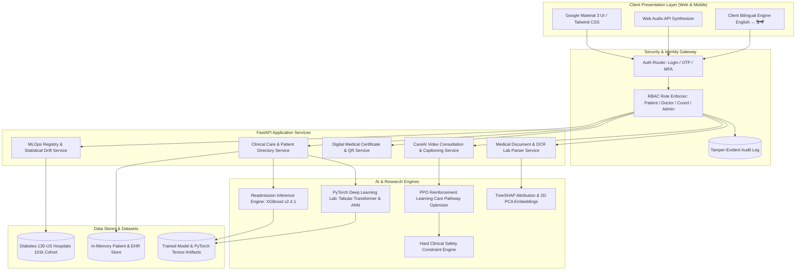

# System Architecture

The **Hospital Readmission Predictor (HRP Clinical)** platform is engineered around an 8-layer modular clinical intelligence stack designed for low latency, secure data handling, and explainable decision support.

---

## 1. High-Level Architectural Topology

---

## 2. Layer-by-Layer Architectural Breakdown

### Layer 1: Client Presentation Layer
- **Google Material 3 Clinical Design**: Styled using a custom healthcare theme, prioritizing clarity and patient-safe color coding (Green: $\le 30\%$, Amber: $31-60\%$, Red: $\ge 61\%$).
- **Web Audio API Engine** (`static/js/sound_engine.js`): Pure native oscillator/gain synthesis providing zero-latency acoustic feedback without external audio files.
- **Client Bilingual Engine** (`static/js/i18n.js`): Real-time DOM attribute translation (`data-i18n`) allowing instant switching between English and हिन्दी without page reload.

### Layer 2: Security & Identity Gateway
- **Role-Based Access Control (RBAC)**: Strict permission boundaries enforcing data isolation between patients and healthcare providers.
- **Multi-Factor Authentication (MFA)**: 6-digit time-expiring OTP verification for sensitive clinical access.
- **Emergency Break-Glass Access**: Controlled protocol granting acute access during emergency admissions while recording an immutable audit entry.

### Layer 3: Application Services Layer (FastAPI)
- Lightweight ASGI architecture running on Python 3.11 with asynchronous route handlers for fast throughput.
- Jinja2 server-rendered templates combined with JSON REST endpoints for hybrid integration.

### Layer 4: AI & Deep Learning Engines
- **Predictive ML**: XGBoost classification bundle achieving $0.9794$ ROC-AUC.
- **Deep Learning**: PyTorch Tabular Transformer and Feedforward ANN with Batch Normalization.
- **Explainability**: TreeSHAP computing exact local feature attributions against background expectation $E[f(x)]$.

### Layer 5: Reinforcement Learning & Clinical Safety Guardrails
- **MDP Environment**: 6-stage simulated care trajectory ($t_0 \text{ Admission} \to t_5 \text{ 30d Outcome}$).
- **PPO Policy Engine**: Optimizes post-discharge coordination interventions.
- **Safety Engine**: Hard boundaries intercepting prohibited autonomous medical actions.
