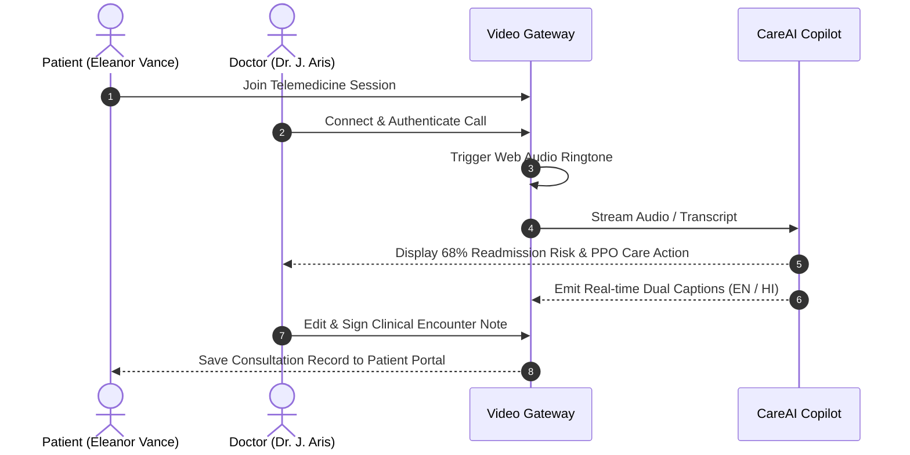

# Telemedicine Video Consultation

Located at `/consultation/careai`, the Video Consultation system connects patients and healthcare providers through an encrypted, AI-augmented clinical consultation interface.

---

## 1. Consultation Lifecycle

---

## 2. Key Interface Features

1. **Simulated WebRTC Video Stream**: High-definition video with camera, microphone, screen sharing, and full-screen controls.
2. **Web Audio Ringtone**: Custom harmonic synthesizer tone announcing incoming clinical connections.
3. **Dual Live Subtitles**: Real-time line-by-line synchronized English and Hindi subtitles for accessibility and ESL patients.
4. **CareAI Sidebar**: Live patient summary, longitudinal risk history chart, vital signs, and PPO decision-support recommendations.
5. **Encounter Documentation**: Real-time editable clinical note pane with one-click EHR persistence.
